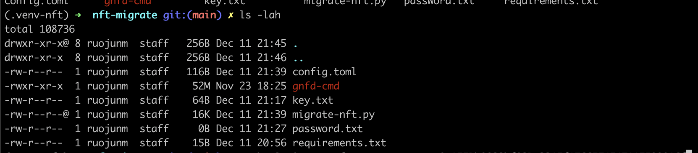
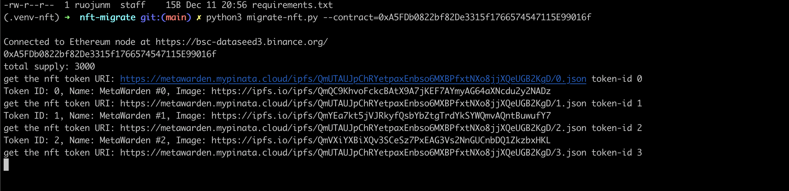
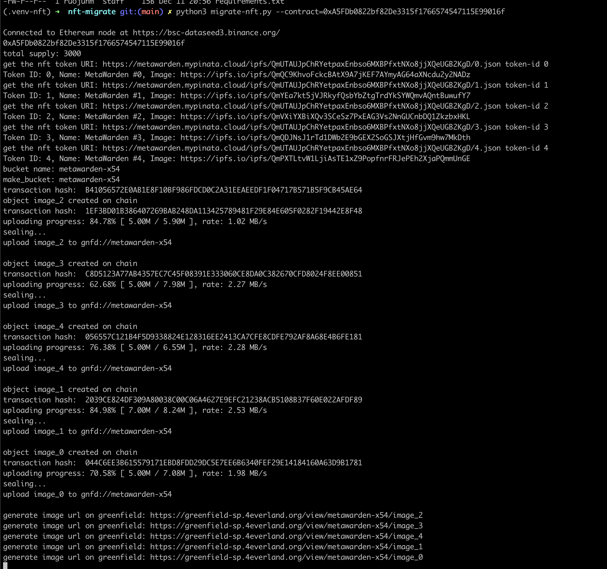
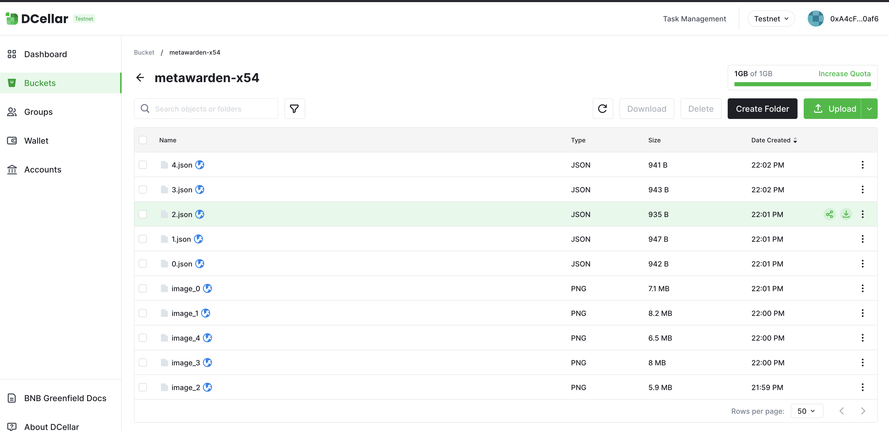

# Setup Environment

This example will use python3 ([web3](https://web3py.readthedocs.io/en/latest/quickstart.html)) and [greenfield cmd tool](https://github.com/bnb-chain/greenfield-cmd). We will use greenfield [TestNet](https://docs.bnbchain.org/docs/beaconchain/develop/rpc#testnet) environment in this example. 

## Clone greenfield-nft-migration Repo
```
git clone git@github.com:bnb-chain/greenfield-nft-migration.git
```

## Setup python virtual envs
```
# Install virtualenv if it is not available:
$ sudo pip install virtualenv
# Create a virtual environment:
$ virtualenv -p python3 ~/.venv-nft
# Activate your new virtual environment:
$ source ~/.venv-nft/bin/activate
```
## Install Python3 and web3 module
```shell
pip install --upgrade pip setuptools
pip install -r requirements.txt
```


# Setup Greenfield CMD tool
You can refer to https://docs.bnbchain.org/greenfield-docs/docs/tutorials/cli/file-management/overview

## download binary file
Download latest release of greenfield-cmd for either linux or mac. E.g.
```
cd greenfield-nft-migration/nft-migrate/
wget https://github.com/bnb-chain/greenfield-cmd/releases/download/v1.0.2/gnfd-cmd_mac -O ./gnfd-cmd
chmod +x ./gnfd-cmd
```

## Config Network

By deafult the https://github.com/bnb-chain/greenfield-nft-migration/blob/main/nft-migrate/migrate-nft.py script will use greenfield testnet to store those NFT files. 

You can edit https://github.com/bnb-chain/greenfield-nft-migration/blob/main/nft-migrate/migrate-nft.py#L12-L22 if you want to use greenfield mainnet


## Import Account and Generating Keystore

Reference: https://docs.bnbchain.org/greenfield-docs/docs/tutorials/cli/file-management/overview#impport-account-and-generating-keystore


```
./gnfd-cmd account import key.txt

```

Create a password.txt file and input your password you use to import your account in last step. 
```
vim password.txt
```

### Migrate NTFs

Run the nft migration python script:

Get your NFT contact , we take 0xA5FDb0822bf82De3315f1766574547115E99016f as an example. It's an ERC721 contract deployed on BSC Testnet. 

Before you run the example, make sure your directory look like:

```
(.venv-nft) ➜  nft-migrate git:(main)  # you activate the python virtrual environment
(.venv-nft) ➜  nft-migrate git:(main) ✗ pwd
/home/xxxxxxxx/some_dir/greenfield-nft-migration/nft-migrate   
(.venv-nft) ➜  nft-migrate git:(main) ✗ ls -lah
total 108736
drwxr-xr-x@ 8   256B Dec 11 21:45 .
drwxr-xr-x  8   256B Dec 11 21:46 ..
-rwxr-xr-x  1    52M Nov 23 18:25 gnfd-cmd   # the gnfd commnd tool you download from offcial repo release page
-rw-r--r--  1    64B Dec 11 21:17 key.txt    # the private key of your test account address, by using it you just imported your account and generated Keystore
-rw-r--r--@ 1    16K Dec 11 21:39 migrate-nft.py # the nft migration python example
-rw-r--r--  1     0B Dec 11 21:27 password.txt # the password you used when importing your account for gnfd cmd tool.
-rw-r--r--  1    15B Dec 11 20:56 requirements.txt 
```


Run
```
python3 migrate-nft.py --contract=0xA5FDb0822bf82De3315f1766574547115E99016f

```

And you will see 
1. Firstly it script will download NFT files after parsing the contract:
   

2. It will invooke greenfield cmd tool to create bucket and upload those NFTs into greenfield chain and storage providers
    
   
3. After all NFTs are migrated, you can also check them in dcellar:
     